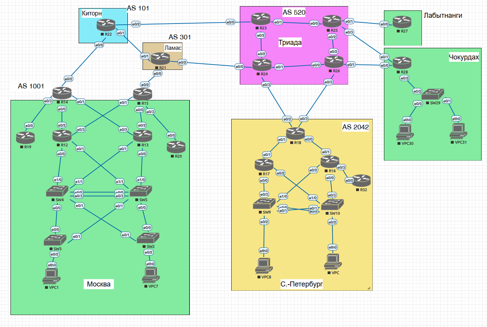

# Лабораторная работа

- 

## Адресное пространство

Для лабораторного стенда разработан IPv4-адресный план с разделением пользовательских, транзитных и управляющих сетей.

В рамках настройки:

- всем активным L3-интерфейсам назначены IPv4-адреса;
- каждый VPC размещён в отдельном VLAN в пределах своего офиса;
- для управления сетевыми устройствами настроены отдельные VLAN и Loopback-интерфейсы;
- офисная сеть разделена на независимые broadcast-домены;
- топология L2-сегмента настроена с учётом предотвращения петель и broadcast-штормов;
- физические соединения используются с учётом резервирования и оптимального распределения трафика.

В лабораторном стенде используется протокол **IPv4**.

